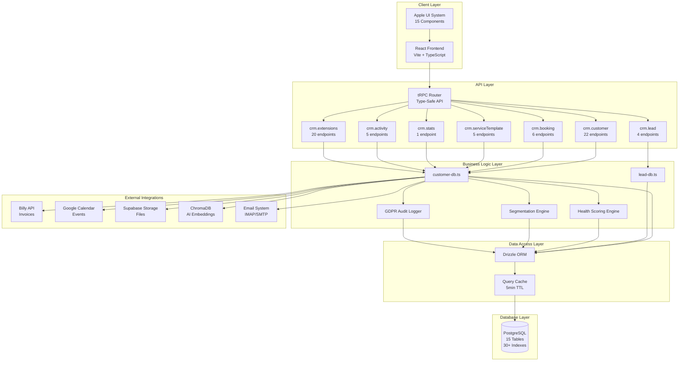
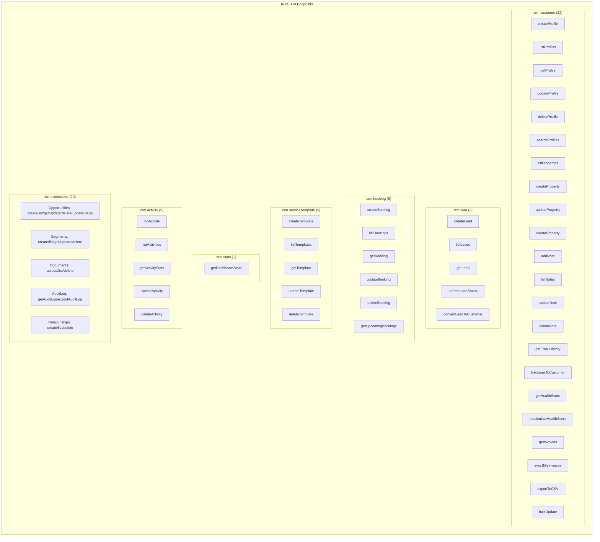
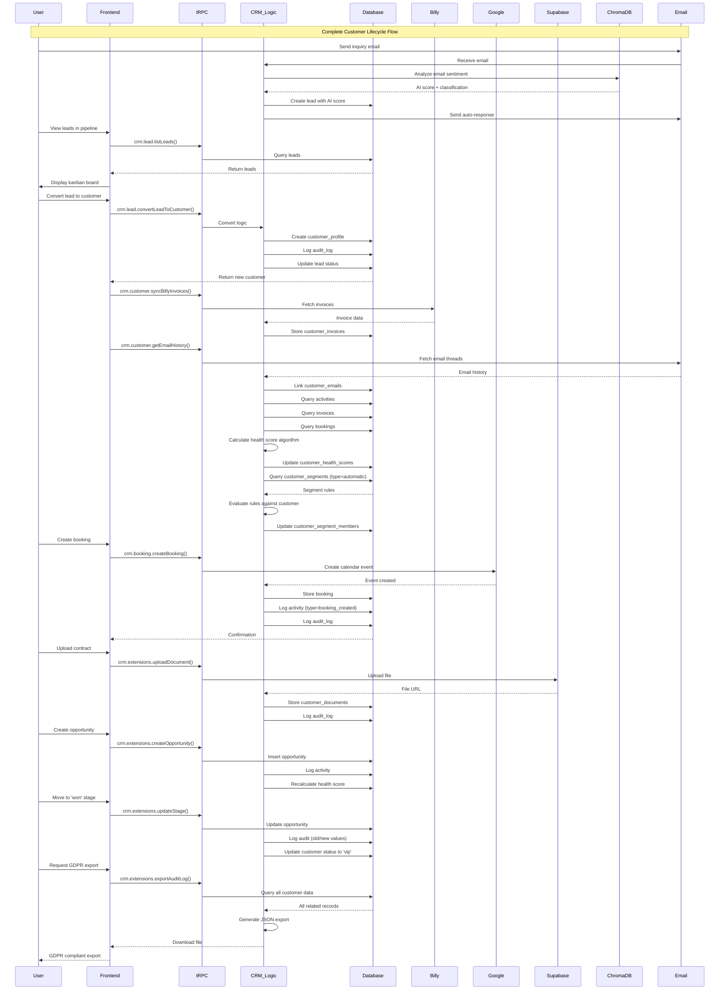
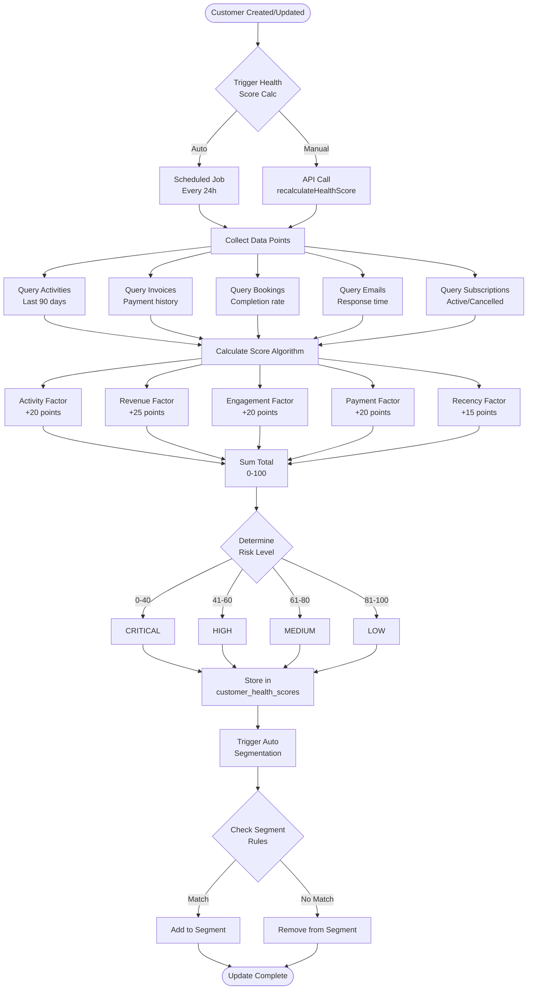
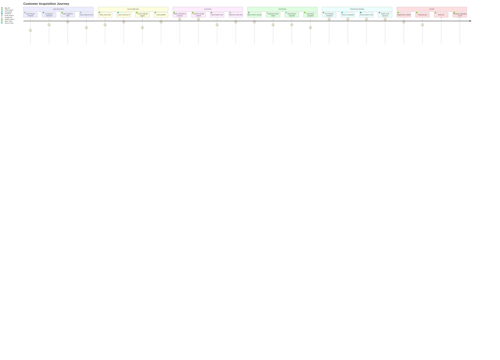
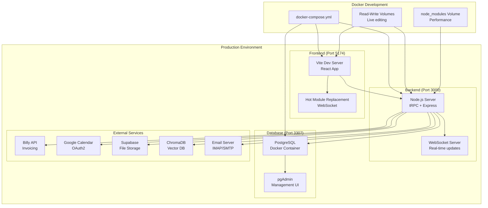
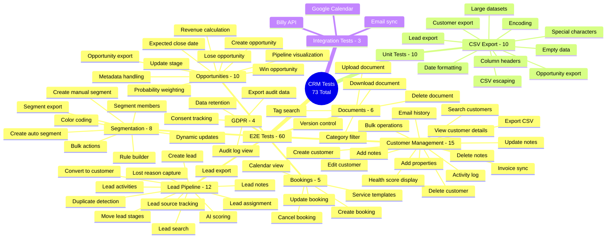
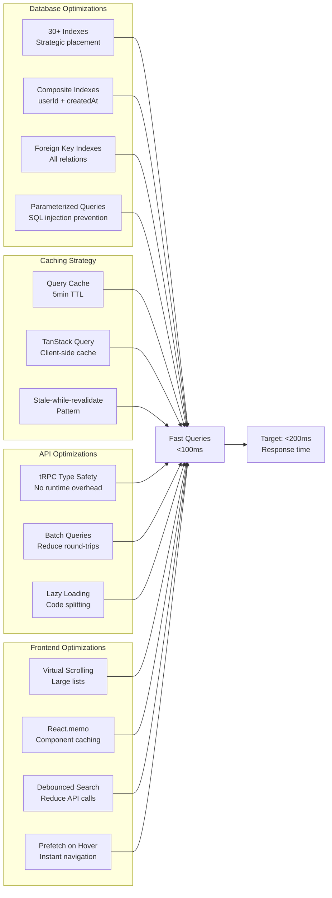

# CRM System - Komplet Visualisering

## 1. System Arkitektur (High-Level)

## 2. Database Schema & Relationships

```mermaid
erDiagram
    customer_profiles ||--o{ customer_properties : has
    customer_profiles ||--o{ customer_notes : has
    customer_profiles ||--o{ customer_activities : has
    customer_profiles ||--o{ customer_health_scores : has
    customer_profiles ||--o{ customer_emails : has
    customer_profiles ||--o{ customer_invoices : has
    customer_profiles ||--o{ bookings : schedules
    customer_profiles ||--o{ opportunities : has
    customer_profiles ||--o{ customer_segment_members : belongs_to
    customer_profiles ||--o{ customer_documents : owns
    customer_profiles ||--o{ customer_relationships : participates_in
    customer_profiles ||--o{ subscriptions : subscribes_to

    leads ||--o| customer_profiles : converts_to
    leads ||--o{ opportunities : generates

    customer_segments ||--o{ customer_segment_members : contains

    service_templates ||--o{ bookings : used_in

    subscriptions ||--o{ subscription_usage : tracks
    subscriptions ||--o{ subscription_history : logs

    customer_profiles {
        uuid id PK
        uuid userId FK
        string name
        string email
        string phone
        enum status
        jsonb tags
        text aiResume
        timestamp createdAt
        timestamp updatedAt
    }

    customer_properties {
        uuid id PK
        uuid customerId FK
        string propertyName
        string address
        float latitude
        float longitude
        jsonb metadata
    }

    customer_notes {
        uuid id PK
        uuid customerId FK
        uuid userId FK
        text content
        timestamp createdAt
        timestamp updatedAt
    }

    customer_activities {
        uuid id PK
        uuid customerId FK
        uuid userId FK
        enum activityType
        text description
        jsonb metadata
        timestamp activityDate
    }

    customer_health_scores {
        uuid id PK
        uuid customerId FK
        int score
        enum riskLevel
        jsonb factors
        timestamp calculatedAt
    }

    leads {
        uuid id PK
        uuid userId FK
        string name
        string email
        string phone
        enum status
        text source
        float aiScore
        uuid convertedToCustomerId FK
        timestamp createdAt
    }

    opportunities {
        uuid id PK
        uuid customerId FK
        uuid userId FK
        string title
        decimal value
        enum stage
        int probability
        date expectedCloseDate
        date actualCloseDate
        jsonb metadata
    }

    customer_segments {
        uuid id PK
        uuid userId FK
        string name
        enum type
        jsonb rules
        string color
    }

    customer_segment_members {
        uuid segmentId FK
        uuid customerId FK
        timestamp addedAt
    }

    bookings {
        uuid id PK
        uuid customerId FK
        uuid serviceTemplateId FK
        uuid userId FK
        enum status
        timestamp scheduledStart
        timestamp scheduledEnd
        timestamp actualStart
        timestamp actualEnd
        text notes
    }

    service_templates {
        uuid id PK
        uuid userId FK
        string name
        text description
        int durationMinutes
        decimal price
        boolean active
    }

    customer_documents {
        uuid id PK
        uuid customerId FK
        uuid userId FK
        string fileName
        string fileUrl
        enum category
        jsonb tags
        int version
        timestamp uploadedAt
    }

    customer_invoices {
        uuid id PK
        uuid customerId FK
        string billyInvoiceId
        decimal amount
        string currency
        enum status
        date dueDate
        timestamp createdAt
    }

    customer_emails {
        uuid id PK
        uuid customerId FK
        string emailId
        string subject
        timestamp sentAt
        text snippet
    }

    customer_relationships {
        uuid id PK
        uuid fromCustomerId FK
        uuid toCustomerId FK
        string relationshipType
        jsonb metadata
    }

    subscriptions {
        uuid id PK
        uuid customerId FK
        string planName
        decimal monthlyPrice
        enum status
        date startDate
        date endDate
        jsonb metadata
    }

    subscription_usage {
        uuid id PK
        uuid subscriptionId FK
        string metric
        int value
        timestamp recordedAt
    }

    subscription_history {
        uuid id PK
        uuid subscriptionId FK
        string action
        jsonb oldValues
        jsonb newValues
        timestamp changedAt
    }

    audit_log {
        uuid id PK
        uuid userId FK
        string entityType
        uuid entityId
        string action
        jsonb oldValues
        jsonb newValues
        string ipAddress
        string userAgent
        timestamp createdAt
    }
```

## 3. API Router Structure

## 4. Frontend Component Hierarchy

```mermaid
graph TD
    App[App.tsx]

    App --> CRMLayout[CRMLayout.tsx<br/>Consistent wrapper]

    CRMLayout --> Dashboard[CRMDashboard.tsx<br/>KPIs & Charts]
    CRMLayout --> CustomerList[CustomerList.tsx<br/>Search & Export]
    CRMLayout --> CustomerDetail[CustomerDetail.tsx<br/>Profile view]
    CRMLayout --> LeadPipeline[LeadPipeline.tsx<br/>Kanban board]
    CRMLayout --> OpportunityPipeline[OpportunityPipeline.tsx<br/>Sales stages]
    CRMLayout --> SegmentList[SegmentList.tsx]
    CRMLayout --> SegmentDetail[SegmentDetail.tsx]
    CRMLayout --> BookingCalendar[BookingCalendar.tsx]

    Dashboard --> RevenueChart[RevenueChart.tsx]
    Dashboard --> HealthScoreWidget[HealthScoreWidget]
    Dashboard --> ActivityTimeline[ActivityTimeline]

    CustomerDetail --> CustomerNotes[Notes section]
    CustomerDetail --> CustomerActivities[Activities section]
    CustomerDetail --> CustomerProperties[Properties section]
    CustomerDetail --> CustomerDocuments[DocumentList.tsx]
    CustomerDetail --> CustomerInvoices[Invoices section]
    CustomerDetail --> CustomerSubscriptions[SubscriptionCard.tsx]

    OpportunityPipeline --> OpportunityColumn[OpportunityColumn.tsx x6]
    OpportunityColumn --> OpportunityCard[OpportunityCard.tsx xN]

    SegmentDetail --> SegmentBuilder[SegmentBuilder.tsx<br/>Rule engine]
    SegmentDetail --> RelationshipGraph[RelationshipGraph.tsx<br/>Network viz]

    CustomerDocuments --> DocumentUploader[DocumentUploader.tsx]

    subgraph "Apple UI System (15 components)"
        AppleButton[AppleButton]
        AppleCard[AppleCard]
        AppleModal[AppleModal]
        AppleDrawer[AppleDrawer]
        AppleInput[AppleInput]
        AppleSearchField[AppleSearchField]
        AppleTag[AppleTag]
        AppleBadge[AppleBadge]
        AppleToast[AppleToast]
        AppleDropdown[AppleDropdown]
        AppleCheckbox[AppleCheckbox]
        AppleToggle[AppleToggle]
        BlurView[BlurView]
        ScrollReveal[ScrollReveal]
        SpringTransition[SpringTransition]
    end

    Dashboard -.uses.-> AppleCard
    Dashboard -.uses.-> AppleButton
    CustomerList -.uses.-> AppleSearchField
    CustomerList -.uses.-> AppleButton
    CustomerDetail -.uses.-> AppleModal
    CustomerDetail -.uses.-> AppleDrawer
    OpportunityCard -.uses.-> AppleBadge
    SegmentBuilder -.uses.-> AppleInput
```

## 5. Integration Flow Diagram

## 6. Data Flow: Health Score Calculation

## 7. User Journey: Lead to Customer

## 8. Deployment Architecture

## 9. Test Coverage Map

## 10. Performance Optimization Map

---

## Legend

- **Boxes**: Components/Modules
- **Cylinders**: Databases
- **Diamonds**: Decision points
- **Arrows**: Data flow / Dependencies
- **Dotted lines**: Optional/conditional flows
- **Subgraphs**: Logical groupings

## File Locations Reference

- **Frontend Pages**: `/client/src/pages/crm/`
- **Frontend Components**: `/client/src/components/crm/`
- **Apple UI**: `/client/src/components/crm/apple-ui/`
- **Backend Routers**: `/server/routers/crm-*.ts`
- **Database Helpers**: `/server/db/customer-db.ts`, `/server/db/lead-db.ts`
- **Database Schema**: `/drizzle/schema.ts` (lines 181-1099)
- **Tests**: `/tests/crm/` (E2E), `/tests/unit/csv-export.test.ts`
- **Utils**: `/client/src/utils/csv-export.ts`
